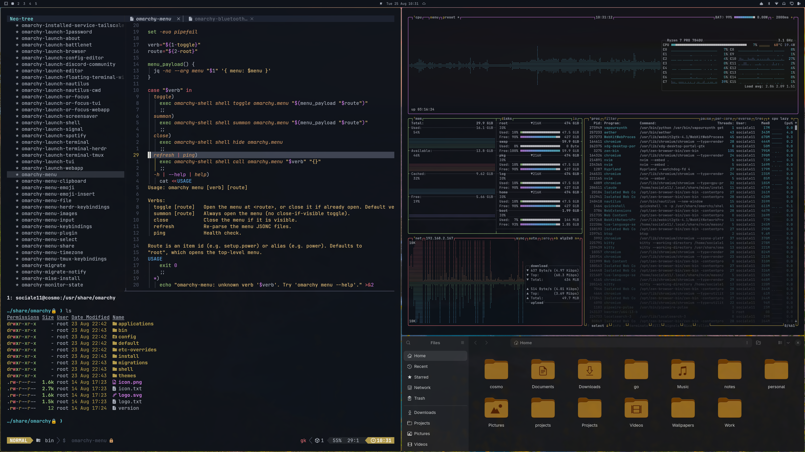

# Cosmo

A dark, cosmic Omarchy theme built around a muted gold accent, deep space
backgrounds, and a One Dark-inspired terminal palette.

Built for **Omarchy v4 (Quattro)**.

## Background

## Colors

| Role               | Hex       |         |
| ------------------ | --------- | ------- |
| Accent             | `#b39c4d` |  |
| Selection          | `#d7dae0` |  |
| Muted              | `#2d3139` |  |
| Background         | `#0f131a` |  |
| Dark background     | `#0b0f14` |  |
| Darker background    | `#080a0d` |  |
| Lighter background   | `#161b25` |  |
| Foreground          | `#abb2bf` |  |
| Dark foreground      | `#7f848e` |  |
| Light foreground     | `#d7dae0` |  |
| Bright foreground    | `#f8f8f0` |  |
| Red                | `#e06c75` |  |
| Yellow             | `#e5c07b` |  |
| Orange             | `#b39c4d` |  |
| Green              | `#98c379` |  |
| Cyan               | `#56b6c2` |  |
| Blue               | `#61afef` |  |
| Magenta            | `#c678dd` |  |
| Brown              | `#976349` |  |
| Bright red          | `#f44747` |  |
| Bright yellow       | `#b39c4d` |  |
| Bright green        | `#98c379` |  |
| Bright cyan         | `#56b6c2` |  |
| Bright blue         | `#b39c4d` |  |
| Bright magenta      | `#7e0097` |  |

## Files

- `colors.toml` — Omarchy/Aether color definitions
- `backgrounds/` — desktop wallpapers
- `icons.theme` — Yaru-yellow
- `neovim.lua` — [cosmo.nvim](https://github.com/sociale11/cosmo.nvim) LazyVim colorscheme spec
- `preview.png` — full desktop preview
